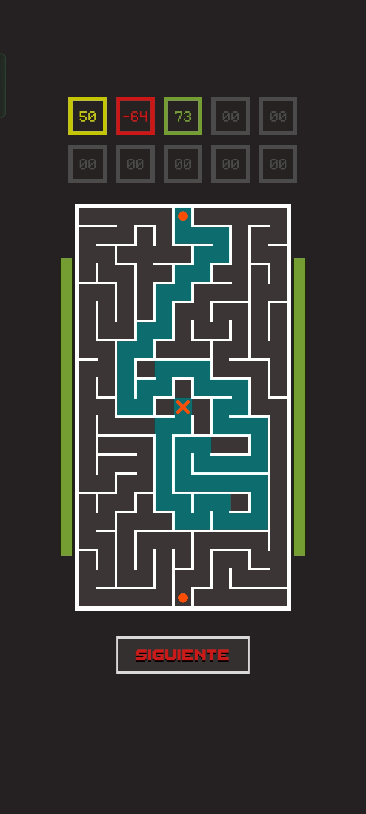

# Maze Game & Player Behaviour Analysis

## 1. Overview

I designed and developed a small mobile maze game using Unity to investigate how players explore routes and adapt their behaviour under time pressure, and how they respond to rewards. The game procedurally generates maze layouts and records player behaviour as timing and decision measures on each trial.

  

This project combines my background in cognitive science and time perception with my interest in game analytics. It allowed me to build a full pipeline from experimental/game design, to gathering gameplay data, to analysing game and player data in R, and finally reaching behavioural insights.

------------------------------------------------------------------------

## 2. Goals & Research Questions

The main goal of this project was to assess how players improve their mental agility, develop strategies, and adapt their behaviour to quantitative rewards in a game environment. More specifically, I was interested in questions such as:

-   How do **response times** change with practice?
-   How do specific **maze features** (turns, crossings, dead ends) affect performance?
-   Can we detect different **exploration strategies** from the sequence of visited cells?
-   How does the **reward** **system** affect player **engagement**?

These questions are closely related to my PhD work on time perception and uncertainty, but here they are applied to a game context.

------------------------------------------------------------------------

## 3. Game Design & Data Collection

The game presents players with a series of maze trials in which there are two possible paths, but only one leads to the exit. On each trial, a maze is **procedurally generated**, with path size and complexity varying across trials. The player must detect which path connects to the exit and respond as quickly as possible to earn points according to their accuracy and speed.

After the response, feedback is given by revealing the correct path in different colours depending on the success of the response. The score of each maze trial is stored and displayed at the top of the screen, accumulating the scores of 10 mazes in a row. After 10 mazes are completed, the block ends and the final average score is revealed.

To analyse behaviour, I implemented a custom **JSON data logging** **system** in Unity:

-   **Block data** summarises information corresponding to a set of 10 trials. This data informs about general performance within a session.
-   **Trial data** logs information to identify each maze, such as its timestamp, path length, response, completion time and score. This is where most of the behavioural information is stored and can be used to evaluate detailed performance, learning and biases.
-   **Cell data** stores the coordinates and type of each cell in the maze (turn, crossing, dead end, etc.). This allows me to rebuild each maze and evaluate factors that could influence difficulty or promote certain strategies or tendencies.

------------------------------------------------------------------------

## 4. Analysis Approach

I used **R** for data cleaning, transformation and visualisation. The analysis pipeline includes:

-   Importing and combining JSON files from different devices and sessions.
-   Creating tidy data tables for blocks, trials and cells.
-   Transforming player data to control for individual differences when needed (e.g., standardising response times within players).
-   Exploring relationships between:
    -   Difficulty metrics and performance metrics such as response time and accuracy;
    -   Learning/practice across game sessions.
-   Understanding factors that could influence participants to stop playing the game.
-   Looking for biases or systematic tendencies in participants’ responses that could help us predict what and when they are going to respond.

At this stage, the analysis is ongoing, but the current version already shows consistent patterns in how players adapt to the maze structure and when they decide to stop or keep playing.

------------------------------------------------------------------------

## 5. Key Findings (so far)

Although the project is still in progress and the analysis is being refined, preliminary explorations suggest:

-   **Practice effects:** players tend to become faster and more accurate over blocks, although they also seem to slow down during the same session (probably indicating an effect of fatigue).
-   **Path length vs time:** longer paths are associated with longer response times, but this relationship is modulated by maze complexity (e.g., number of turns and crossings).
-   **Cell types and difficulty:** mazes with a higher proportion of turns and crossings tend to produce longer exploration times and more errors.
-   **Individual differences:** some players quickly converge to short, efficient paths, while others keep exploring alternative routes for longer.

These findings illustrate how relatively simple maze tasks can reveal rich patterns of exploratory behaviour and strategy.

*(I plan to update this section as I refine the analysis and run more robust models.)*

------------------------------------------------------------------------

## 6. Learnings & Next Steps

From a **technical** perspective, this project allowed me to:

-   Build a complete pipeline from a Unity game to structured JSON data and analysis in R.
-   Practice designing a data system that supports both gameplay and later analysis.
-   Explore how to model and visualise behavioural data from interactive environments.

From a **research and UX / game analytics** perspective, I learned to:

-   Translate abstract research questions (e.g., about exploration, time perception and uncertainty) into concrete game mechanics and metrics.
-   Identify which variables are most informative to understand player behaviour.
-   Communicate findings in a way that can inform design decisions (e.g., difficulty balancing, level design).

Next steps include:

-   Refining the analysis (e.g., mixed models for repeated measures).
-   Improving visualisations for different stakeholders (designers vs researchers).
-   Applying these learnings to redesign the game and delve further into the research questions.
-   Collecting data from a larger and more diverse sample of players.
